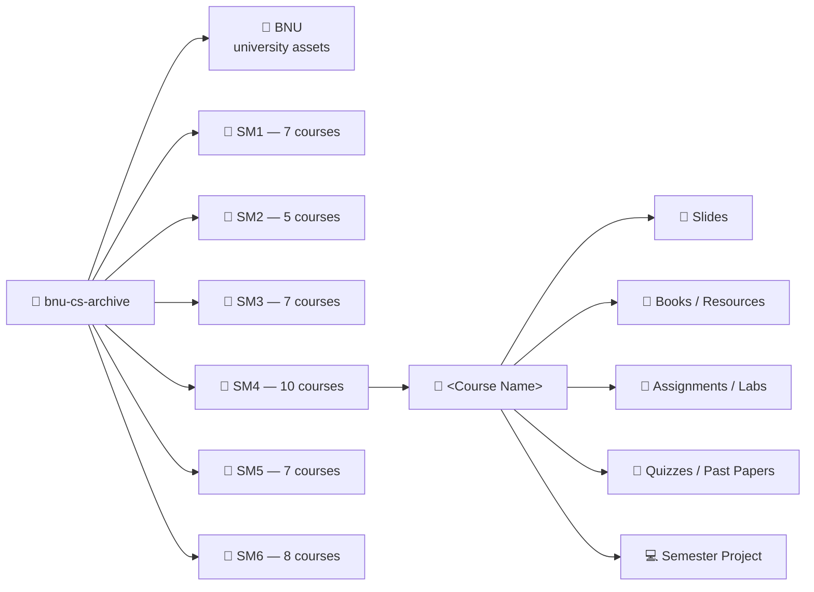

<div align="center">

# 🎓 BNU CS Archive

**A personal academic archive of a BS Computer Science journey at Beaconhouse National University (BNU), Lahore**


-yellow)

</div>

---

## 📖 About

**BNU CS Archive** is the personal course archive of a **BS Computer Science** student (Roll No. `F2023-009`) at **Beaconhouse National University**, covering **six semesters** of coursework — from first-semester general education courses through advanced CS electives like AI, Neural Networks, and DevOps.

The repository is essentially a running backup of everything produced or collected across a CS degree: lecture slides, textbooks, assignments, lab manuals, quizzes, past papers, semester projects, and full source code for course and personal projects. It doubles as a build log of the student's growth — from introductory programming exercises in Semester 2 to a genetic-algorithm-based scheduling app and a UX-researched fintech prototype by Semester 6.

> 💡 This is **not** a curated tutorial or textbook repo — it is a real, working archive, complete with drafts, half-finished experiments, generated build artifacts, and course cohort materials, kept as a historical record of the coursework.

---

## 📋 Table of Contents

- [About](#-about)
- [Purpose](#-purpose)
- [Repository Contents](#-repository-contents)
- [Semester Overview](#-semester-overview)
- [Repository Structure](#-repository-structure)
- [Notable Projects](#-notable-projects)
- [Notable Resources](#-notable-resources)
- [Repository Statistics](#-repository-statistics)
- [How to Navigate](#-how-to-navigate)
- [Future Updates](#-future-updates)
- [Disclaimer](#-disclaimer)
- [License](#-license)
- [Contributing & Security](#-contributing--security)

---

## 🎯 Purpose

This repository serves several purposes:

- **📦 Backup** — a single, version-controlled home for four years' worth of coursework, so nothing gets lost between semesters, laptops, or cloud drives.
- **🗂️ Reference** — a searchable archive of slides, textbooks, and past papers for revision and future lookup.
- **🧑‍💻 Portfolio of growth** — semester projects (like *ClassSync AI* and *DailyKhata*) double as a public record of applied skills in algorithms, databases, AI, and UX design.
- **🤝 Collaboration trail** — group projects (e.g., the *Database Systems* semester project and the *Foreman* Kanban app) preserve the shared work and onboarding docs created with teammates.

---

## 📚 Repository Contents

The archive contains a broad mix of academic and project material, including:

| Category | Examples |
|---|---|
| 📑 **Lecture material** | Slide decks (`.pptx`), lecture PDFs, course outlines |
| 📘 **Textbooks & references** | Assigned course books and supplementary PDFs (`Books/`, `External Resources/`) |
| 📝 **Assessments** | Assignments, lab tasks, quizzes, midterm/final past papers and solutions |
| 💻 **Source code** | C++, Python, JavaScript/TypeScript, and web projects for labs and semester projects |
| 🗄️ **Semester projects** | Full applications with reports, UI mockups, and presentations |
| 🖼️ **Design & UX artifacts** | Wireframes, navigation flows, Figma exports, screenshots |
| 🗓️ **Administrative documents** | Timetables, room allocations, the student handbook |
| 🧾 **Reports & documentation** | Word/PDF reports, onboarding guides, project write-ups |

---

## 🗓️ Semester Overview

| Semester | Folder | Courses | Focus Areas |
|---|---|---|---|
| **1st** | [`SM1`](./SM1) | 7 | Calculus, Applied Physics (+ Lab), Functional English, Ideology & Constitution of Pakistan, Intro to ICT, Creating Web Content |
| **2nd** | [`SM2`](./SM2) | 5 | Programming Fundamentals (+ Lab), Digital Logic Design, Probability & Statistics, Expository Writing |
| **3rd** | [`SM3`](./SM3) | 7 | Object Oriented Programming (+ Lab), Database Systems (+ Lab), Discrete Structures, Multivariable Calculus, Programming for AI |
| **4th** | [`SM4`](./SM4) | 10 | Data Structures & Algorithms (+ Lab), Artificial Intelligence (+ Lab), Advanced DBMS (+ Lab), Computer Organization & Assembly Language (+ Lab), Linear Algebra |
| **5th** | [`SM5`](./SM5) | 7 | Operating Systems (+ Lab), Analysis of Algorithms, Neural Networks & Deep Learning, Software Engineering, Web Engineering, Digital Marketing |
| **6th** | [`SM6`](./SM6) | 8 | Computer Networks (+ Lab), HCI & Computer Graphics (+ Lab), DevOps & Cloud Computing Foundations, Digital Finance & Blockchain Technologies, Theory of Automata, Professional Practices |

A [`BNU`](./BNU) folder additionally holds university branding assets (logos, icons) used across projects and documents.

---

## 🗂️ Repository Structure



Each course folder generally (though not always identically) breaks down into some combination of: **Slides, Books/Resources, Assignments, Labs, Quizzes, Past Papers,** and a **Project** folder for semester-long deliverables. Some courses are further organized **week-by-week** (e.g. `Week 1`, `Week 2`, …) rather than by category.

A simplified top-level tree:

```
bnu-cs-archive/
├── BNU/                                    # University logos & branding assets
├── SM1/                                    # Semester 1 — 7 courses
│   ├── Applied Physics/
│   ├── Applied Physics LAB/
│   ├── Calculus & Analytical Geometry/
│   ├── Creating Web Content/
│   ├── Functional English/
│   ├── Ideology & Constitution of Pakistan/
│   └── Introduction to ICT/
├── SM2/                                    # Semester 2 — 5 courses + admin docs
│   ├── Digital Logic Design/
│   ├── Expository Writing/
│   ├── Probability and Statistics/
│   ├── Programming Fundamentals/
│   └── Programming Fundamentals LAB/
├── SM3/                                    # Semester 3 — 7 courses + admin docs
│   ├── Database Systems/  (+ LAB)
│   ├── Discrete Structures/
│   ├── Multivaribale Calculus/
│   ├── Object Oriented Programming/  (+ LAB)
│   └── Programming for AI/
├── SM4/                                    # Semester 4 — 10 courses
│   ├── Advanced Database Management Systems/  (+ Lab)
│   ├── Artificial Intelligence/  (+ Lab)
│   ├── Computer Organization & Assembly Language/  (+ Lab)
│   ├── Data Structures & Algorithms/  (+ Lab)
│   ├── Linear Algebra/
│   └── Misc/
├── SM5/                                    # Semester 5 — 7 courses
│   ├── Analysis of Algorithms/
│   ├── Digital Marketing/
│   ├── Neural Networks and Deep Learning/
│   ├── Operating Systems/  (+ Lab)
│   ├── Software Engineering/
│   └── Web Engineering/
├── SM6/                                    # Semester 6 — 8 courses
│   ├── Computer Networks/  (+ Lab)
│   ├── DevOps & Cloud Computing Foundations/
│   ├── Digital Finance & Blockchain Technologies/
│   ├── HCI & Computer Graphics/  (+ Lab)
│   ├── Professional Practices/
│   └── Theory of Automata/
└── README.md
```

---

## 🚀 Notable Projects

A few standout projects contained in the archive:

### 🧠 ClassSync AI — `SM4/Artificial Intelligence/`
A **genetic-algorithm-based university timetable scheduler**, built as a desktop application. The folder contains multiple iterations of the project (including a visual/GUI variant), packaged Windows builds, project documentation, drafts, and a formal project report — reflecting an evolution from a course assignment toward a more polished standalone tool.

### 🧾 DailyKhata — `SM6/HCI & Computer Graphics Lab/Project/`
An **HCI-driven expense-tracking app concept for Pakistani users**, developed across five milestones (M00–M04). Includes slide decks, wireframes, navigation flow diagrams, and usability-focused design artifacts documenting the full UX design process from ideation to prototype.

### 🗄️ Database Systems Semester Project — `SM3/Database Systems/Semester Project/`
A team-built database project ("Section B DBS") credited to **Saad Mughal, Muhammad Ismail Rana, and Sheikh Muhammad Ibrahim**, including full source and supplementary materials.

### 📋 Foreman — `SM6/DevOps & Cloud Computing Foundations/Project/`
Documentation (onboarding guides, implementation plan, walkthroughs, and handover notes) for a **Kanban board team project**, built as part of the DevOps & Cloud Computing course.

### 🕸️ Course & Lab Mini-Projects
Numerous smaller projects and exercises are scattered throughout the labs and assignments — including Object-Oriented Programming projects (e.g. a Huge-Integer class, a rational-number class), Data Structures & Algorithms assignments, and Operating Systems lab exercises.

---

## 📎 Notable Resources

- **Textbook collections** — Reference books for courses such as Discrete Structures, Programming Fundamentals (Malik, Gaddis), Neural Networks & Deep Learning, and Digital Finance & Blockchain Technologies.
- **University administrative documents** — Semester timetables, room allocations, and the official **BNU Student Handbook (2024)**.
- **External cohort repositories** — Shared course materials from instructor/cohort GitHub repos (e.g. an OOP cohort repository and an ML cohort repository) included for reference alongside personal coursework.
- **University branding assets** — Official BNU logos and icons (`BNU/`) used across reports and presentations.

---

## 📊 Repository Statistics

> Generated directly from the repository's Git tree.

| Metric | Value |
|---|---|
| 📁 Semesters archived | **6** (`SM1`–`SM6`) |
| 🎓 Course folders | **44** |
| 📄 Total tracked files | **~20,920** |
| 🖼️ Images (`.png` / `.jpg`) | **~4,300** |
| 📕 PDF documents | **~714** |
| 📘 Word documents (`.docx`) | **~204** |
| 📊 Spreadsheets (`.xlsx`) | **~198** |
| 🖥️ Presentations (`.pptx`) | **~198** |
| 📝 Markdown files | **~254** |
| 💻 Source/code files | C++, Python, JS/TS, and more, spanning course labs, semester projects, and vendored dependencies |

**Largest single project by file count:** *ClassSync AI* (`SM4/Artificial Intelligence`), which alone accounts for thousands of files — a result of multiple packaged desktop-app builds and their bundled runtime dependencies being included in the archive.

---

## 🧭 How to Navigate

1. **Start at a semester folder** (`SM1` → `SM6`) to browse chronologically.
2. **Drill into a course folder** by name — e.g. `SM4/Artificial Intelligence`.
3. Within a course, look for common subfolders:
   - `Slides` / `Books` — lecture and reading material
   - `Assignments` / `Labs` / `Quiz` — coursework and assessments
   - `Project` / `Semester Project` — larger deliverables
   - `Week N` folders — for courses organized by weekly schedule instead
4. Use GitHub's **file search** (press `t` on the repo page, or use the search bar) to jump directly to a filename if you know roughly what you're looking for — the archive is large, and search is often faster than browsing.

---

## 🔮 Future Updates

This repository is a **living archive** and will continue to grow as coursework progresses through the remaining semesters of the degree. Expect:

- New semester folders as they are completed
- Additional personal and course projects
- Periodic cleanup of build artifacts and redundant drafts

---

## ⚠️ Disclaimer

This repository is a **personal academic archive**, shared publicly for reference, backup, and portfolio purposes.

- Course materials — including **slides, textbooks, past papers, and other instructional content** — belong to their respective instructors, publishers, and/or **Beaconhouse National University**, and are included here for **personal, educational, and non-commercial reference only**.
- **No copyright is claimed** over third-party or university-provided material. If you are a rights holder and would like specific content removed, please open an issue.
- Some folders contain **third-party or cohort-shared repositories** (e.g. instructor/classmate GitHub repos) included for reference; these retain their original authorship and licensing where applicable.
- **Original coursework, projects, and reports** authored by the repository owner (and credited collaborators, where applicable) remain the property of their respective authors.
- This archive is provided **as-is**, with no guarantee of completeness, accuracy, or fitness for any particular purpose — it reflects real, in-progress student work rather than polished, production-ready material.

---

## 📜 License

Original work in this repository (personal source code, reports, and documentation authored by the repository owner) is licensed under the [MIT License](./LICENSE).

This license **does not** extend to:
- Third-party or university-provided course materials (slides, textbooks, past papers, the student handbook), which remain the property of their original owners.
- Vendored dependencies and cloned cohort repositories (e.g. `node_modules/`, shared course repos), which retain their own original licenses.

See the [`LICENSE`](./LICENSE) file for the full scope note.

## 🤝 Contributing & Security

- Interested in reporting a broken link, incorrect file, or copyright concern? See [`CONTRIBUTING.md`](./CONTRIBUTING.md).
- Found exposed credentials, sensitive data, or a security issue in one of the embedded projects? See [`SECURITY.md`](./SECURITY.md) for how to report it responsibly.

